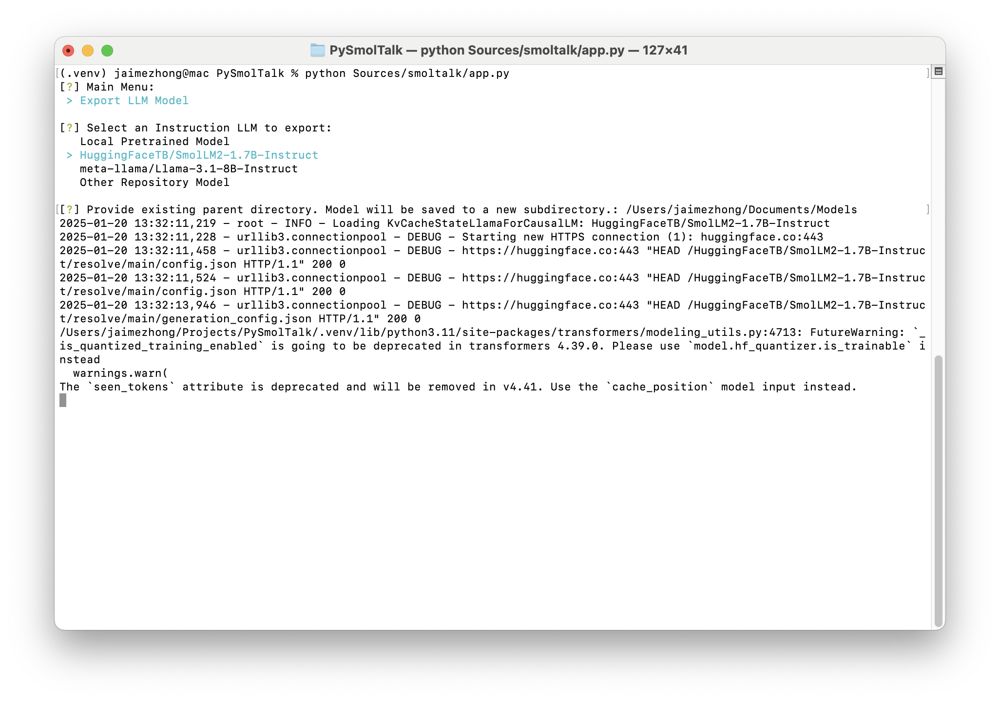

PySmolTalk
===

Interactive Command Line Interface for converting PyTorch LLMs to CoreML format.

## Installation

Requires Python 3.11

```commandline
cd $PROJECT_ROOT
python -m venv .venv
source .venv/bin/activate
pip install -r requirements/common.txt
```

## Usage

Begin an interactive session and follow the prompts.

```commandline
export PYTHONPATH=$PROJECT_ROOT/Sources:$PYTHONPATH
python Sources/smoltalk/app.py
```



*PySmolTalk will provide an interactive interface for exporting a model to an directory*
